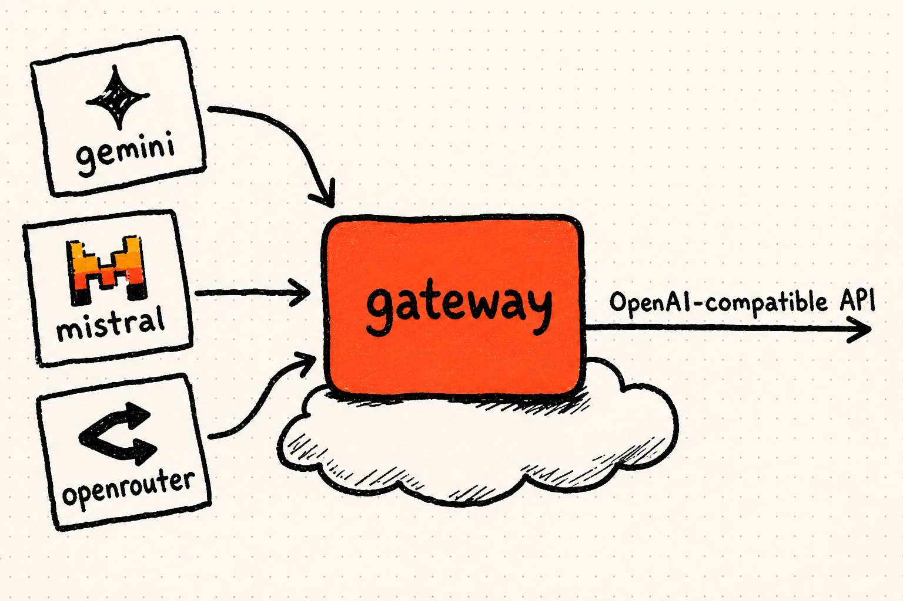
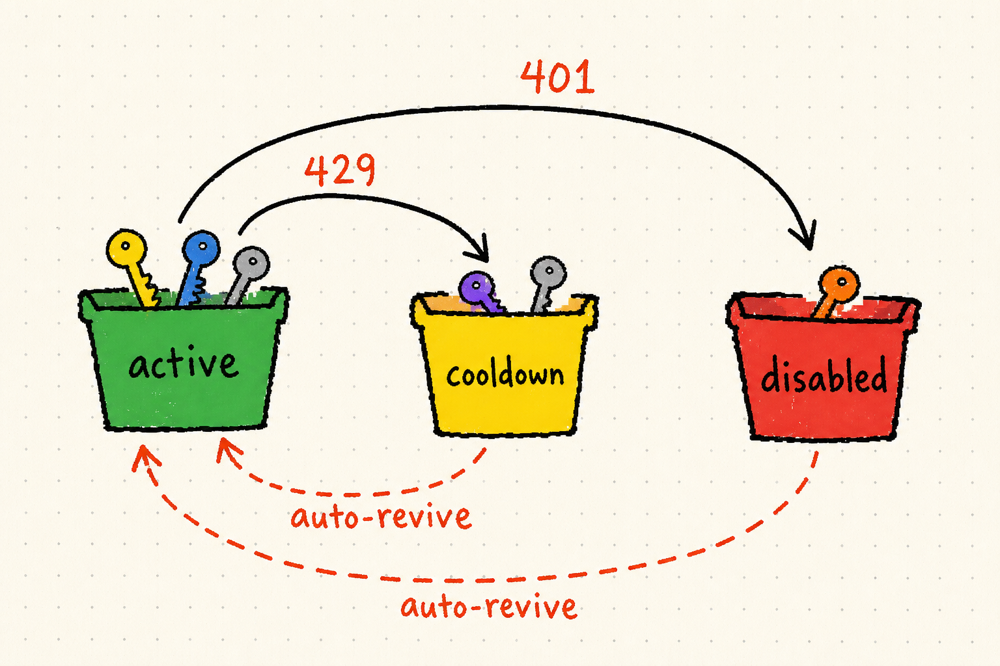

# cloudflare-llm-gateway

A serverless, **OpenAI-compatible LLM API gateway** for **Cloudflare Workers** — a
[new-api](https://github.com/QuantumNous/new-api) / [one-api](https://github.com/songquanpeng/one-api)
style gateway that runs entirely on the **free tier** (Workers + D1, no server, no Redis).



Pool many upstream AI API keys (Gemini, Mistral, OpenRouter) behind one stable
OpenAI-compatible endpoint. Dead keys auto-disable, rate-limited keys cool down
and auto-revive, and you get a built-in admin console + optional SSO.

## Features

- **OpenAI-compatible API** — `POST /v1/chat/completions`, `GET /v1/models`. Point any OpenAI SDK at it.
- **Native passthrough** — `/gemini/*`, `/mistral/*`, `/openrouter/*` proxy each provider's raw API with a pooled key.
- **Key pool with self-healing** — round-robin across active keys; `401/403` → auto-disable, `429`/quota → cooldown, success → revive. A cron (or `POST /admin/probe`) re-checks keys.
- **Per-key console** — list every key (masked), its status & stats, with live "check / balance" (OpenRouter shows real credits) and enable/disable/delete.
- **Roles** — admin manages the pool, users self-serve their own API tokens. Optional **OIDC SSO** (Authorization Code + PKCE) with an admin-approval gate; or simple bearer-token auth.
- **$0 to run** — Cloudflare Workers + D1 free tier.

## Architecture

```
client ──▶ Worker (Hono) ──▶ pick active key ──▶ upstream provider
                │                                    (Gemini/Mistral/OpenRouter)
                ├─ D1: keys, tokens, users, logs
                └─ cron / POST /admin/probe: revive cooldowns, probe disabled keys
```

Keys self-heal: a `429`/quota error cools a key down, a `401`/`403` disables it,
and both auto-revive (on a successful retry, or via the cron / `/admin/probe`).



## Setup

```bash
npm install

# 1. create the D1 database, then paste its id into wrangler.toml
npx wrangler d1 create llm-gateway
cp wrangler.toml.example wrangler.toml      # edit database_id (+ optional SSO vars)

# 2. apply the schema
npx wrangler d1 execute llm-gateway --remote --file=./schema.sql

# 3. set secrets
npx wrangler secret put ADMIN_TOKEN         # bearer token for admin/API
npx wrangler secret put SESSION_SECRET      # random 32+ bytes (for SSO sessions)

# 4. deploy
npx wrangler deploy
```

Open the deployed URL to reach the admin console.

## API

| Method & path | Auth | Purpose |
|---|---|---|
| `POST /v1/chat/completions` | user token / session | OpenAI-compatible chat |
| `GET /v1/models` | user token / session | list available models |
| `/gemini/*` `/mistral/*` `/openrouter/*` | user token / session | native passthrough |
| `POST /admin/keys/import` | admin | bulk-import `provider:key` lines |
| `GET /admin/keys/list` | admin | every key + stats |
| `POST /admin/keys/:id/check` | admin | live liveness / balance probe |
| `POST /admin/keys/:id/enable\|disable`, `DELETE /admin/keys/:id` | admin | per-key ops |
| `GET /admin/users`, `POST /admin/users/:id/approve\|block` | admin | approve consumers |
| `GET/POST/DELETE /me/tokens` | session | consumers manage their own tokens |
| `POST /admin/probe` | admin | run the health check on demand |

### Import keys

```bash
curl https://YOUR_WORKER/admin/keys/import \
  -H "Authorization: Bearer $ADMIN_TOKEN" \
  -H 'content-type: application/json' \
  -d '{"keys":"gemini:AIza...\nmistral:...\nopenrouter:sk-or-v1-..."}'
```

### Use it

```bash
curl https://YOUR_WORKER/v1/chat/completions \
  -H "Authorization: Bearer <user-token>" \
  -H 'content-type: application/json' \
  -d '{"model":"mistral-small-latest","messages":[{"role":"user","content":"hi"}]}'
```

## Notes

- **Terms of service:** aggregating / sharing / reselling provider API keys may
  violate the upstream providers' terms. Use it to pool **your own** keys, and
  review each provider's ToS before exposing it to others.
- SSO is optional — leave `OIDC_*` unset to run with `ADMIN_TOKEN` + minted
  tokens only.

## License

MIT
